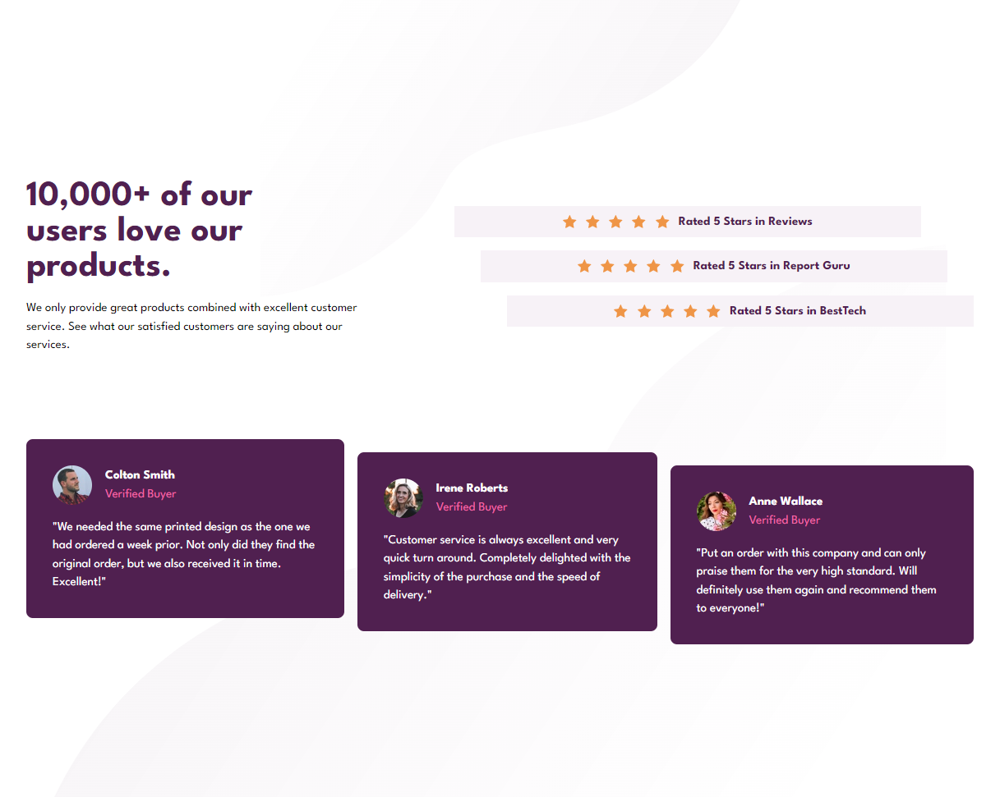

# Frontend Mentor - Social proof section solution

This is a solution to the [Social proof section challenge on Frontend Mentor](https://www.frontendmentor.io/challenges/social-proof-section-6e0qTv_bA). Frontend Mentor challenges help you improve your coding skills by building realistic projects. 

## Table of contents

- [Frontend Mentor - Social proof section solution](#frontend-mentor---social-proof-section-solution)
  - [Table of contents](#table-of-contents)
  - [Overview](#overview)
    - [The challenge](#the-challenge)
    - [Screenshot](#screenshot)
    - [Links](#links)
  - [My process](#my-process)
    - [Built with](#built-with)
    - [What I learned](#what-i-learned)
  - [Author](#author)

## Overview

### The challenge

Users should be able to:

- View the optimal layout for the section depending on their device's screen size

### Screenshot

### Links

- Solution URL: [here](https://www.frontendmentor.io/solutions/social-proof-section-by-ali-jabrayilzade-ubGuJ3wKhH)
- Live Site URL: [here](https://social-proof-section-ali-jabrayilzade.netlify.app/)

## My process

### Built with

- Semantic HTML5 markup
- Atomic css
- Flexbox
- CSS Grid
- Mobile-first workflow

### What I learned

how to orginize my css more in atomic style

## Author

- Frontend Mentor - [Jabrayilzade Ali](https://www.frontendmentor.io/profile/jabrayilzadeali)
- Twitter - [Jabrayilzade Ali](https://twitter.com/JabrayilzadeAli)